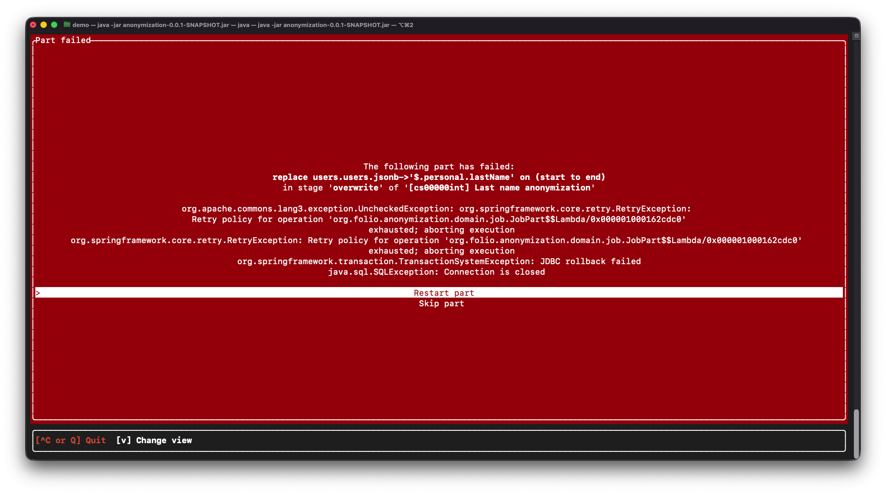

# Interactive mode

- [Invocation](#invocation)
- [Default jobs](#default-jobs)
- [Usage tips](#usage-tips)
- [Choosing tenants](#choosing-tenants)
- [Choosing jobs](#choosing-jobs)
- [Monitoring progress](#monitoring-progress)
- [Error handling](#error-handling)
- [End](#end)

## Invocation

To run in interactive mode, simply run the JAR with no arguments: `java -jar anonymization-tool.jar`.

Logs will be stored in `logs/application.log`.

> [!NOTE]
>
> If the application appears to hang after showing the Spring banner and does not display "You should see an interface shortly...", your database connection is likely not functioning properly. Check the logs for more information.

> [!NOTE]
>
> If the application appears to hang after showing "You should see an interface shortly...", your terminal may not be able to render the interface (some IDEs or web based terminals may have this issue). You should be able to resolve this by using a regular terminal application.

## Default jobs

By default, all jobs are enabled except the following:

- Custom property definitions
  - This includes the actual names and descriptions of custom properties themselves, which we do not foresee as containing PII (outside of incredibly contrived examples along the lines of a checkbox of "Needs James's review" or something). Custom field **values** will be anonymized by default as part of a different job.
  - Additionally, due to technical limitations, we cannot fully anonymize these definitions for users nor purchase orders. The original field's `name` is used to generate a `refId` which is used to store the custom field's values in the actual records (for example, "Custom field 1" may generate a `refId` of `customfield1`). We do not support changing these IDs so it is theoretically possible for someone to analyze the API traffic or database tables and determine the original name of the field based on the `refId`.
- Global configuration property deletion
  - We maintain a list of known global configuration properties and how to handle them (disregarding them if they do not contain PII), however, `mod-configuration` and `mod-settings` can theoretically store configuration values that we do not know.
  - Any configuration properties that we do not know how to handle will be listed as `unknown configuration/setting type` and, if enabled, delete all configurations of this type. We do not enable this by default, however, users should carefully examine each unknown configuration type to determine if it should be deleted (or otherwise manually handled).
  - Any properties that appear on this list should be reported to ensure they are properly categorized and handled in future runs of the tool.

## Usage tips

Available keybinds for a given screen are always shown at the bottom of the interface (and are typically what you would expect, e.g. arrow keys for navigation and `Space` for selection/toggling).

Every page will have either animated text or a spinner (for the job execution detail view) to indicate that the application is still running and the connection was not interrupted. If this stalls, you may need to re-connect to the session if you are using `screen` or `tmux`, or check the logs for any errors.

> [!WARNING]
>
> Some text may be cut off if the viewing terminal is not wide enough. If you see content that appears to be truncated or rendering oddly, try expanding the width of your terminal window. The keybind toolbar should always be exactly one line, so if you see a second blank line, that is a good indication that the terminal is not wide enough to render the interface properly.

## Choosing tenants

Once started, you will be presented the option to select which tenants you would like to run the tool on. These are loaded from `public.tenants` and group by consortium, where applicable.

After selecting tenants and completing this step (the "Next" button must be highlighted to be triggered), the tool will scan each tenant's databases in depth to determine exactly which anonymization procedures are applicable.

## Choosing jobs

Once tenant information is loaded, you will be presented with a list of anonymization jobs which can be performed. By default, all will be enabled except for the "Custom property definitions", which we do not recommend; see [default jobs](#default-jobs) for more information.

This page is separated into two parts. The left sidebar allows selecting which tenant to configure jobs for and the main area lists the jobs. To view more details about a job, select it using the arrow keys and use the right arrow key to expand it (make sure to `Tab` away from the tenant list first!). This will show a brief description of the job and which fields it applies to. You can toggle the entire job, or an individual part, on or off using `Space`.

> [!NOTE]
>
> Pay special attention to any jobs which show as `unavailable` — this means we could not find a given column or schema in a tenant. Typically this is nothing to worry about (for example, ECS tables are not available in unaffiliated tenants, and `mod-configuration` may not have anything to anonymize in tenants which are running Trillium (as some of these configurations were removed)).

Once everything is ready, press `G` and confirm to start the anonymization process.

## Monitoring progress

After everything has been started, you will be greeted with a progress bar showing the overall completion of the selected jobs. For more details, press `V` to change views; this will show a list of all running jobs, their current step, and allow you to drill down into each job to see which fields are currently being worked on.

This is the easy part — once the jobs are running, they can be left to run for as long as they take. If an error is encountered with a particular part, all others will continue executing, allowing you to handle issues asynchronously.

Tip: If you aren't seeing everything you'd expect in the details view, press 'R' — many jobs will add new sub-jobs as they run, and this will refresh the view to show new ones.

> [!NOTE]
>
> The keys `<` and `>` can be used to adjust the thread pool size and `{` and `}` can be used to adjust the database connection pool size, which allows you to optimize performance based on how the environment is handling the load.
>
> While the tool is running, you should keep an eye on the metrics for the tool and the database server to find a good balance between concurrent execution and not overwhelming the database.

## Error handling

In the event a failure does occur, a message will display with the part and some information about the exception. Based on this, you can choose to:

- Retry the part
  - Re-inserts the part into the queue to be retried after all other currently queued parts have executed. This is useful for transient issues (connection issues, etc).
- Skip the part
  - This will not attempt to retry the part and potentially leave the data covered by it unanonymized, however, the rest of the job will continue to execute. Note that this includes later stages (for example, a field in the "Username anonymization" job being skipped during the `enumerate` stage will still allow successive stages like `apply-new-values` and even `cleanup` to run).
  - Any parts skipped will be reported at the end so they can be reviewed and handled as needed.

> [!NOTE]
>
> Sometimes these exception tracebacks will not render correctly, or may not include enough information to determine the cause. The full exception with traceback will always be logged in the log (`logs/application.log`), so be sure to check there for more details.

## End

Once everything is finished, a green screen will appear reporting that everything has completed successfully, listing all jobs performed and a list of any parts which failed and were skipped. A more detailed version will be saved in `logs/application.log` (which also includes any jobs disabled at the beginning) and we recommend saving this report for future reference.
